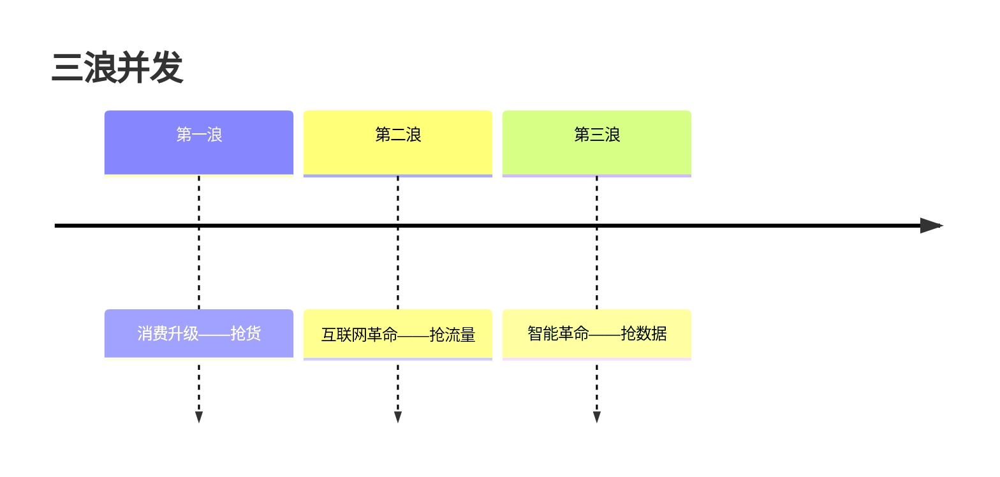

# 增长征途 — 一句话定位：五级台阶拾级而上，靠共同体加深、靠广度扩疆、在三浪并发里选浪

## 框架

### 1. 增长五台阶（每级靠不同的东西上台阶）

| 台阶 | 跨越 | 靠什么 |
|---|---|---|
| 家庭 | 0 → 1 | **破局点** |
| 部落 | 1 → 10 | **杠杆** |
| 村庄 | 10 → 100 | **资源放量** |
| 城市 | 100 → 1000 | **分形复制**（把成功单元标准化后成建制复制） |
| 国家 | 1000 → 10000 | **扛得起巨大苦难**（体系、韧性与信念） |

用上一级的打法打下一级 = 卡在台阶上。

### 2. 用户深度：从流量到共同体
人性的弱点能引来流量（贪嗔痴驱动的点击来得快去得也快），但**商业的文明建立在人性的光明上**：随着数据化、信用化加深，靠信用与责任才能把浅关系沉淀成**共同体**——彼此守护的深度关系，才守得住地盘。

### 3. 市场广度
一地验证的模式向更大市场复制：本土纵深 → 国际化 → 全球化。跨出去的组织会被新环境重塑——"上岸的鱼再也不是鱼"，广度扩张必然伴随自我改造。

### 4. 三浪并发
当下市场三代模式同场竞技：
- 第一浪：消费升级——比拼的是**货**，握住供给就赢
- 第二浪：互联网革命——入口是**流量**，谁握住流量谁就能把货组织起来
- 第三浪：智能革命——入口是**数据**；流量是消耗品、越花越少，数据是资产、越沉越厚，握住数据的人反过来能调度流量

同一门店生意，表面在卖货，核心竞争力可能早已是背后的数据与算法。选浪 = 判断你的品类此刻在哪一浪、下一浪何时拍过来。

### 5. 地图、道路与底牌（总纲）
增长思维的三件交付：**地图**（看清战场与阶段）、**道路**（价值观决定你走哪条路）、**底牌**（命运拿不走的那张牌——你的使命与核心能力）。

## 图

## 怎么用

1. 台阶定位：按规模与状态判断你在哪一级？当前打法与台阶匹配吗？
2. 深度检查：你的用户是流量还是共同体？（复购、转介绍、危机时是否站你）
3. 广度检查：现有模式在下一个市场的复制条件齐了吗？组织准备好被重塑了吗？
4. 选浪：你的品类正处在哪一浪？你在为下一浪积累数据资产吗？
5. 底牌盘点：写下命运拿不走的那张牌——它决定你敢走多远
6. 判断题：你的下一级台阶，靠现在的打法上得去吗？

## Checklist

- [ ] 台阶定位清晰，打法与台阶匹配
- [ ] 有从流量到共同体的沉淀动作（信用、责任、深度服务）
- [ ] 广度扩张有验证-复制的节奏，不是盲目铺
- [ ] 数据资产在积累（为第三浪备牌）
- [ ] 我能一句话说出自己的增长底牌

## 反模式

| 错误做法 | 为什么错 | 正确做法 |
|---|---|---|
| 用 1→10 的杠杆打法冲 100→1000 | 缺分形能力，规模一上就散架 | 按台阶换打法 |
| 只收割流量不建共同体 | 浅关系来得快去得快 | 用信用与责任沉淀深度 |
| 在第二浪的存量里内卷 | 下一浪的玩家会降维打你 | 提前备第三浪的数据牌 |
| 说不出自己的底牌 | 没有底牌的扩张是空中楼阁 | 先认清底牌再定征途 |
