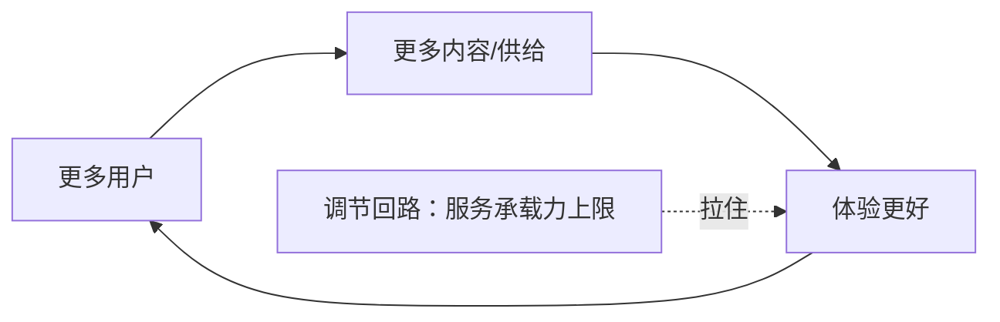

# 增强回路与调节回路 — 一句话定位：增长靠模式里的回路，不靠意志力

## 框架

模式是由**连接**驱动的。四种连接：

| 连接 | 含义 | 对增长的作用 |
|---|---|---|
| 因果链 | A 导致 B 的单向链条 | 基础逻辑，但不自增长 |
| **增强回路** | A 增强 B，B 反过来增强 A | 增长的发动机——转起来就自己滚大 |
| **调节回路** | 系统里把变化拉回原状的力量 | 增长的刹车——不识别它，发动机白转 |
| 滞后反馈 | 动作与结果之间存在时间差 | 让人误判——见效慢就以为无效 |

**核心论点**：心理能量有尽头，节能是生物本能——靠意志力维持的增长必然衰竭，**能自转的增强回路才是可持续的增长引擎**。设计模式的本质，就是设计一条核心增强回路，并拆掉（或绕开）拖后腿的调节回路。

## 图

## 怎么用

1. 写出你业务的核心因果链（做什么 → 得到什么）
2. 找闭环：结果能不能反过来增强起点？能 → 这是你的增强回路候选
3. 找刹车：列出所有把增长拉回去的力量（产能上限、成本上升、体验稀释、政策约束）
4. 逐条处理调节回路：能拆的拆（扩容/标准化），不能拆的绕（换模式）
5. 标注滞后：哪些动作要多久才见效？在见效期内用什么先行指标观测？
6. 判断题：你的增长现在靠回路自转，还是靠团队咬牙硬推？

## Checklist

- [ ] 我能画出核心增强回路（≤4 个节点的闭环）
- [ ] 每个节点之间的增强关系有数据验证，不是想象
- [ ] 拖后腿的调节回路列全了且有处理方案
- [ ] 滞后反馈的动作配了先行指标，不会误判"无效"

## 反模式

| 错误做法 | 为什么错 | 正确做法 |
|---|---|---|
| 把增长问题归因于执行不努力 | 意志力靠不住，模式才靠得住 | 检查回路，不骂团队 |
| 只设计发动机不看刹车 | 调节回路会吃掉全部增长 | 发动机和刹车一起设计 |
| 因为滞后就放弃正确动作 | 见效慢 ≠ 无效 | 用先行指标撑过滞后期 |
| 回路节点依赖外部平台 | 别人随时能掐断你的闭环 | 关键节点收进自己手里 |
