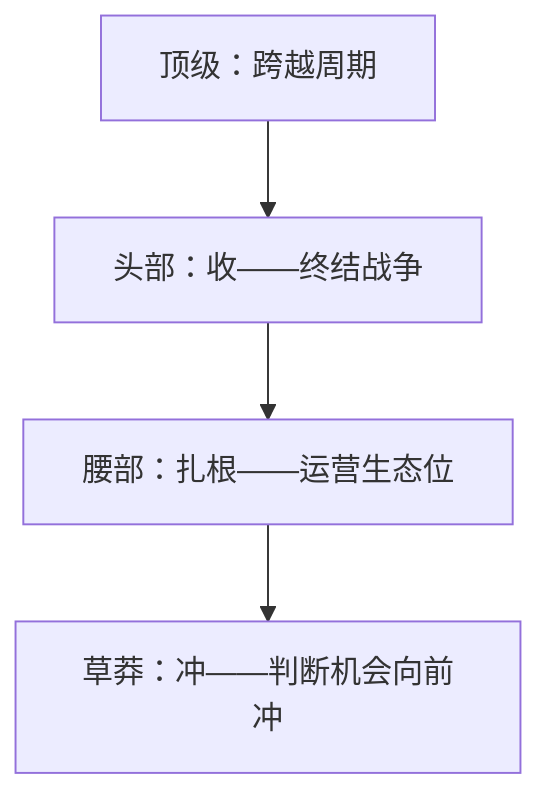

# 四层玩家地图 — 一句话定位：先确认你在战场的哪一层，再决定怎么打

## 框架

商业战场上的企业分四层，每层的核心动作完全不同：

| 层级 | 核心动作 | 动作内涵 |
|---|---|---|
| 草莽 | **冲** | 看到机会先扑上去，用行动换认知，赌把墙撞穿 |
| 腰部 | **扎根** | 选定一个生态系统，和周边环境结成盘根错节的关系，占稳生态位 |
| 头部 | **收** | 看清整个战场全图，集结资源拿下制高点，终结一场行业战争——你的高度就是行业的高度 |
| 顶级 | **跨越周期** | 一条曲线走到头之前，把主体业务迁入新的大趋势，穿越不止一个时代 |

**层级判断的底层逻辑**：草莽的生死由它所在生态系统的丰瘠决定；腰部的关键是看见生态变化并作出选择；头部拼的是终局视野与资源集结力；顶级拼的是跨周期的决策力。

### 认知地图：你的决策信息环境
- 一个人的判断水平，约等于他最常接触的信息环境的水平。
- 组织里创新最大的敌人是"全员对齐领导表情"——执行力越强的公司越容易只剩共识。
- 保护非共识的办法是**物理隔离视线**：把讨论拆成多桌分组，让大多数人看不到老板的脸色，不一致的想法才有机会长出来。

## 图

## 怎么用

1. 定位：按上表判断你/你的业务当前在哪一层？（判断题：你现在的核心动作，和你所在层级匹配吗？）
2. 生态检查：你附着的生态系统在生长还是在枯萎？（草莽/腰部必答）
3. 全图检查：你能画出你所在战场的全图吗？制高点在哪里？（头部必答）
4. 周期检查：你当前曲线还有几年？下一条曲线的准备开始了吗？（顶级必答）
5. 信息环境检查：你的关键决策，有几个不同视角参与？非共识有没有表达通道？

## Checklist

- [ ] 我能一句话说出自己在四层中的位置和依据
- [ ] 我的核心动作与层级匹配（草莽在冲 / 腰部在扎根 / 头部在收 / 顶级在备下一曲线）
- [ ] 我清楚自己附着的生态系统的兴衰趋势
- [ ] 我的决策桌上有真实的非共识声音

## 反模式

| 错误做法 | 为什么错 | 正确做法 |
|---|---|---|
| 草莽期就想学头部打法（铺资源、建体系） | 没有制高点视野和资源，学了只会拖死自己 | 先冲，用行动换认知 |
| 腰部期无视生态系统的枯萎 | 生态没了，扎再深的根也白扎 | 盯生态变化，及时迁移 |
| 全员围着老板的判断转 | 只剩共识 = 没有创新 | 分桌讨论，给非共识留通道 |
| 把层级当荣誉而不是打法选择 | 层级的意义是决定动作，不是排名 | 按层级选动作 |
