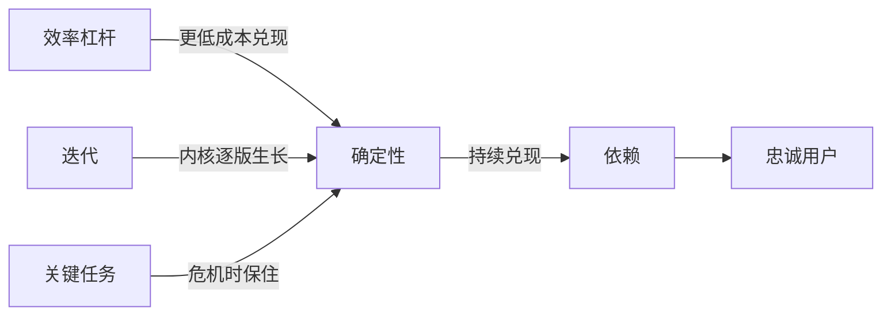

# 系统能力 — 一句话定位

用户看到的产品只是截面，真正交付价值的是背后那套持续运转的系统：建系统能力，就是保障确定性、构筑效率杠杆、靠迭代生长，并在危机时刻押注关键任务。

## 框架

四个子框架共同回答一个问题：这套系统凭什么值得用户依赖、凭什么赢过对手。

### 1. 确定性：产品的本质交付物

- 用户不为界面付费，为「每次都兑现的结果」付费。取款机的价值不在外壳好不好看，在插卡就有钱出来。
- 以服务视角替代产品视角：用户要的不是钻头，而是墙上的孔。从用户拿到结果的那一刻，倒推整条交付链路该怎么搭。
- 确定性产生依赖，依赖沉淀为忠诚；一次供给中断烧掉的信任，远多于十次界面美化攒下的好感。
- 兑现确定性靠整条链路：战略选点、运营评估、资源供给、硬件维护、客服兜底、技术支撑，缺一环即断供。单点功能保不住承诺。
- 显性外壳只是冰山露出水面的部分；水下的资金占用与运营成本才是大头，没算清就开工的团队多数死在这里。

### 2. 效率：系统的竞争杠杆

- 企业本身就是分工提效的产物。两套系统交付同样的确定性时，成本更低、周转更快的一方赢。
- 效率革命发生在三层：组织（成果数字化、一线直接承接用户反馈）、渠道（线上数据反哺线下网络）、供应链（集中火力打少数型号，摊薄研发）。
- 小米曾以效率为核心杠杆：压缩机型集中研发，再用电商沉淀的数据能力驱动线下渠道快速铺开，完成销量下滑后的翻盘。
- 竞品以为在拼产品，其实在拼系统效率——表面战场与真实战场常常错位。

### 3. 世界观与迭代：系统如何生长

- 产品是做产品的人的世界观外化：团队对哪类用户压力敏感、亲历过哪种匮乏，决定功能取舍的方向。
- 迭代 = 最小可用内核先站住，验证后逐版本生长；前一版为后一版铺路，次序比功能数量重要。
- 第一版取舍法：只留验证核心假设必需的功能；为「心里没底」而堆的附加功能是自我安慰，砍掉。
- 小功能可以撬动大盘：微信红包以一个轻量玩法借节日场景引爆，把绑卡支付从小众推向全民。识别标志：高频动作 × 强情绪场景 × 极低上手成本。
- 自然传播有圈层边界，撞墙后要借外部势能（头部场景、渠道、事件）破壁。
- 推动用户升级或迁移也是产品动作：给一个让人主动想换的理由，而不是命令式弹窗强制执行。

### 4. 生死线：关键任务

- 日常靠流程与分工，危机靠领导力：从一堆待办里认出那件「不做必死、做成即活」的事，就是关键任务。
- 穿越生死线的动作组合：收缩产品线、压扁组织层级、资源全部押到关键任务、领导人直插一线把控细节。
- 危机时刻组织最需要确定性指令，不是民主讨论；用得罪人换生存是划算的交易。
- 危机之外的安稳地带没有壁垒；敢接别人不敢接的风险，本身就是护城河。
- 对风险的姿态分四级：知道风险存在 → 会绕开风险 → 备有预案 → 敢驾驭风险换回报。生死线级别的机会，只属于最后一级。

## 图

## 怎么用

### 定确定性

1. 用一句话写出你向用户承诺的确定性（动词 + 结果，不含形容词）。
2. 列出兑现这句承诺的全部环节与岗位，逐项标注成本。
3. 判断：哪一环断掉承诺就落空？我的资本与能力覆盖得了全链条吗？

### 建效率杠杆

1. 找出系统里最大的成本项或最慢的环节。
2. 问：这一环从零设计会怎么做？分工给谁效率最高？
3. 判断：我的效率优势对手能否简单模仿？模仿不了的那部分才是护城河。

### 排迭代路线

1. 砍第一版：删到再删一个功能核心假设就无法验证为止。
2. 排版本次序：每一版只回答一个问题，并为下一版做铺垫。
3. 判断：当前版本的数据验证了什么？哪个轻量功能可能借势撬动大盘？

### 危机时抓关键任务

1. 写出全部死法，反推唯一活路，那就是关键任务。
2. 停掉与关键任务无关的项目，资源与人手全部倾斜过去。
3. 判断：我是否还在用日常管理应对生死问题？我敢不敢为此得罪人？

## Checklist

- [ ] 我能一句话说清产品交付的确定性
- [ ] 兑现确定性的全链条成本已算清且覆盖得起
- [ ] 系统里有一个对手难以复制的效率优势
- [ ] 第一版只含验证核心假设的最小功能集
- [ ] 版本路线有次序设计，前版为后版铺路
- [ ] 留意到了可能撬动大盘的轻量高频功能
- [ ] 用户升级与迁移有产品化设计，不靠强制
- [ ] 若明天进入危机，我知道关键任务是什么

## 反模式

| 错误做法 | 为什么错 | 正确做法 |
|---|---|---|
| 把热情花在外观与界面打磨 | 显性特征不构成依赖，断供一次即清零 | 先保障确定性供给，再谈体验 |
| 第一版塞满功能求心安 | 附加功能稀释资源，掩盖核心假设未验证 | 最小内核上线，用数据说话 |
| 只盯产品战场，忽视效率战场 | 对手的真实杠杆在组织与供应链层 | 对标对手的系统效率而非功能列表 |
| 危机中仍按日常流程推进 | 流程管理解不了生死问题 | 识别关键任务，资源全部倾斜 |
| 增长撞墙后原地加码投放 | 圈层边界靠自然传播突不破 | 借外部势能与头部场景破壁 |
| 按创始人自己的需求做取舍 | 团队世界观的盲区会原样变成产品盲区 | 深入目标用户的真实场景校准体感 |

## 案例速写

- 取款机：界面再朴素也有生命力，因为背后养着一整条现金调度与维护链路，稳定兑现「插卡出钞」。
- 通讯工具三岔口：起点相似的几款产品，一款深耕熟人沟通、一款连接陌生人、一款连向线下商业——世界观不同，终局迥异。
- 老牌安全软件公司：强敌碾压下砍掉多数产品线、压平层级，全员押注两款核心产品，数月后借行业变局完成翻身。
