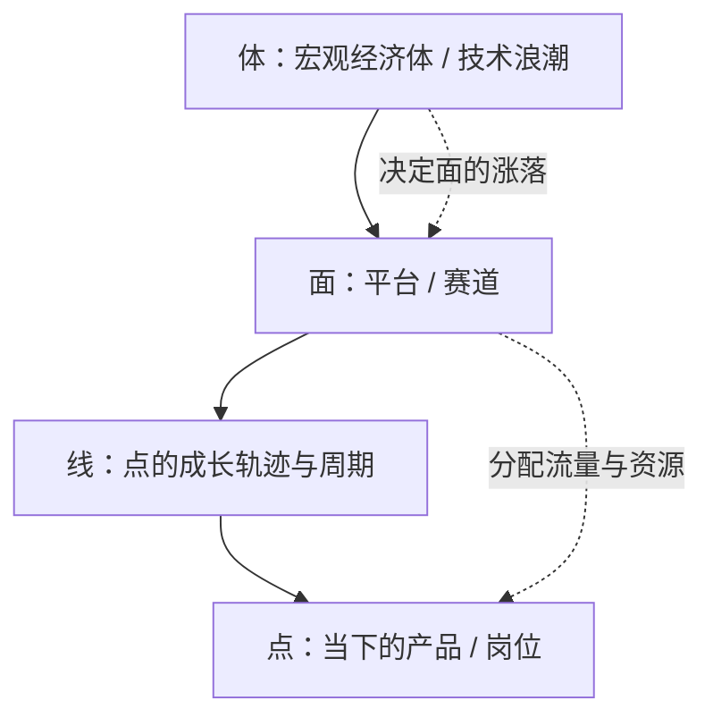

# 点线面体 — 个体的勤奋只是一个点，回报量级由它所附着的线、面、体决定

## 框架

四个层级，自下而上嵌套：

| 层级 | 含义 | 例子 |
| --- | --- | --- |
| 点 | 当下的产品、岗位、单笔生意，投入即时、回报也即时 | 一款工具、一份月薪 |
| 线 | 点随时间展开的成长轨迹，一段完整的兴衰周期 | 一条业务曲线、一段职业路径 |
| 面 | 承载点的平台或赛道，向点分配流量与资源 | 一个平台生态、一个行业 |
| 体 | 面所依附的宏观经济体，决定面的涨落 | 一次技术浪潮、一国产业结构 |

三个推论：

- **回报分层**。点只产出计时式收入；线给出一个周期的复利；面和体的抬升才带来量级差异。两个人能力相当而境遇悬殊，多半是各自附着的面与体一升一沉。
- **位置即势能**。同样一块石头，摆在平地只能靠肌肉推，搬上高坡就自带落差。评估机会不能只掂量石头本身，要看它放在哪。
- **面打架，点吃红利**。两个面争夺同一市场时，会向关键位置的点让利输血，身处其中的点能拿到远超自身产出的资源。

**求之于势，不责于人**：胜负押在位置与落差上，而不是逼身边的点更拼命。怯懦与懈怠是人性常量，指挥者的职责是把整个组织搬到有落差的高地，让位置替每个人赋能。

### 面的势能与趋势怎么看

判断一个面值不值得附着，看四个信号：

- **增速**：面自身的用户、交易、资本是否高速增长；只是存活不算数。
- **新经济体**：它是否搭在一个正在膨胀的体上——新技术、新人口、新基础设施出现时，面会成批诞生。
- **战争红利**：面与面是否正在开战；开战的面才会大手笔向点让利。
- **周期位置**：进入太晚，增长段已被吃完；进入太早，得独自熬过荒年。

反面信号同样明确：面里人人都在赚快钱、老玩家靠惯性收租、人才与资本在净流出——这样的面撑不起线性回报。

## 怎么用

1. **定点**：写下你当下真正做得到、能稳定交付的那件事。判断问题：这是踮脚才够得着的目标，还是闭眼也能持续供给的能力？
2. **画线**：推演这个点未来三到五年的轨迹。判断问题：它处在周期的启动段、爬坡段还是衰退段？我打算持有多久？
3. **认面**：找出给这个点分配流量与资源的平台或赛道。判断问题：这个面在扩张还是守成？它正与谁开战？开战时会向哪些点让利？
4. **验体**：看这个面搭在什么宏观载体上。判断问题：这个经济体的人口、资本、技术是净流入还是净流出？
5. **比势能**：把同一个点换到别的面、别的体上重摆一遍。判断问题：位置换了，同样投入能多释放几倍能量？
6. **辨对手**：分清压力来源。判断问题：威胁来自同行，还是来自趋势本身？若是后者，点上的任何优化都救不了局。
7. **弃快钱**：用投资心态收尾。判断问题：这个机会我能不能拿住一个完整周期，而不是赚一笔就下车？

## Checklist

- [ ] 我能一口气说清自己的点、线、面、体分别是什么
- [ ] 我选的面处于高速增长，而不是仅仅还活着
- [ ] 我确认过体的方向：它在崛起，不在缓慢下沉
- [ ] 规划里含至少一次完整周期的线性回报，而非只有计件收入
- [ ] 我识别了面与面的战争，并知道自己能否站到让利的一侧
- [ ] 面对团队短板，我先找外部势能，而不是加压内部的点
- [ ] 我没有用赚快钱的逻辑挑机会
- [ ] 关键决策时，我隔离了情绪，先看结构再看感受
- [ ] 我承认了自己当下真实的能力边界，起点是做得到的点
- [ ] 若面确认下沉，我有迁移预案，而不是加倍勤奋

## 反模式

### 单点死磕
- 错误做法：把全部精力押在打磨当下这一个点上，指望优化和勤奋改命。
- 为什么错：点只有计时回报，结构选错时，效率翻倍也突破不了量级。
- 正确做法：先验结构——线、面、体没选错，再回来打磨点。

### 在静止的面上勤奋
- 错误做法：面早已停止增长甚至悄悄下坠，仍在上面拼命耕耘。
- 为什么错：面不动，点的努力只是原地消耗；更糟时，面底下的体也在漏气，越勤奋越被动。
- 正确做法：定期复核面与体的增速，一旦确认下沉，尽早迁移。

### 憋大招、够高点
- 错误做法：不甘心从做得到的事起步，非要跳起来抓一个远超当下实力的点。
- 为什么错：够着的点无法稳定供给，长期关系（用户、市场）只认你可持续交付的样子。
- 正确做法：从稳定供给的点起步，把野心放进线的规划里。

### 责于人
- 错误做法：把胜负押在下属的意志力上，靠施压和抱怨榨取产出。
- 为什么错：一个点再压榨也只有一个点的资源；害怕、惜力是常态，苛责改变不了人性。
- 正确做法：去外部找势能高地，用落差给全员赋能，这才是带队者的本职。

### 赚快钱
- 错误做法：见点就吃、随涨随抛，哪里热闹奔哪里。
- 为什么错：永远收不到一个周期的复利，也攒不出面级的位置。
- 正确做法：选定崛起中的体，找准高增速的面，陪它走完成长段。

### 只对点有感觉
- 错误做法：评估机会（或人）时，反复纠结眼前这个点配不配、值不值。
- 为什么错：任何点都是它背后线、面、体的产物；对结构无感，就只能守株待兔。
- 正确做法：从点上跳出来，研究托着它的线在什么周期、面在什么位置，再回来出手。

## 图

## 案例速写

- 免费安全工具借上网人口爆发的面，掀翻了按份卖拷贝的老牌杀毒厂商——不是点赢了点，是新的面淹没了旧的点。
- 一家起步最早的网约车公司站错了靠山，错过两大巨头为移动支付开战时倾泻给打车应用的资源，先发优势归零。
- 搜索大战正酣时，夹在几家公司之间的工程师身价一年翻了几倍——面开打，点上的人先拿到红利。
- 同届毕业的两个人，一个进了扩张中的科技平台，一个进了萎缩中的纸媒：几年后境遇天差地别，差的不是个人素质，是所附着的体。
