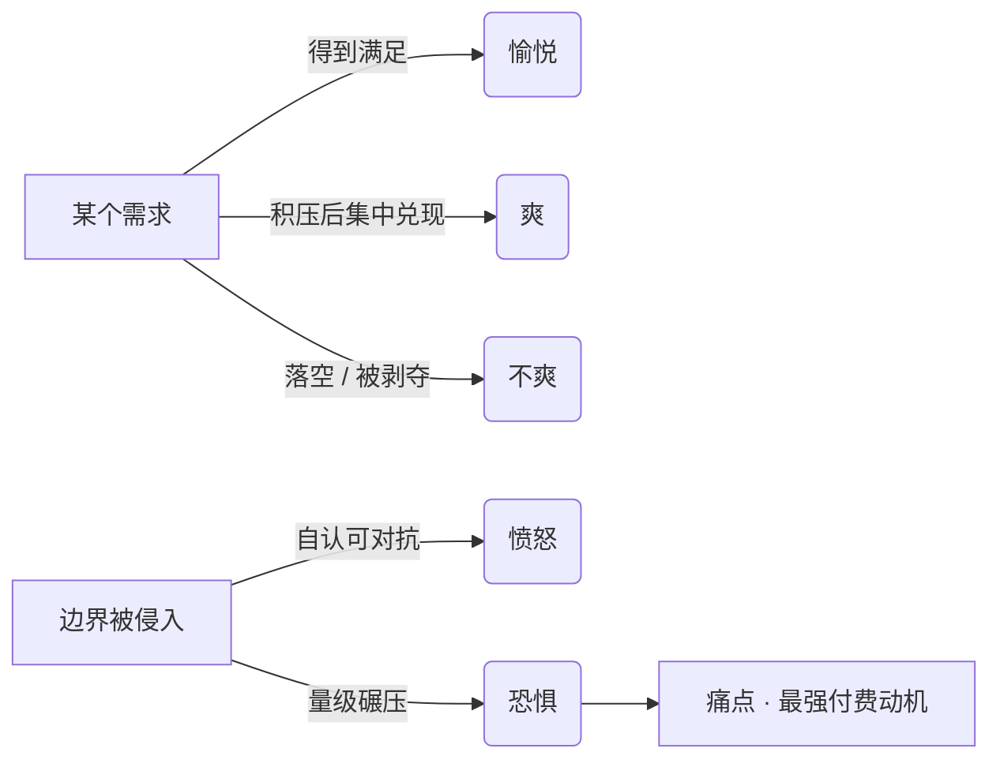

# 情绪四件套 — 用情绪信号读出用户的真实需求

## 框架

**为什么从情绪入手**：普通用户没有受过表达训练，讲不清楚自己的体验，但情绪装不出来也压不住。语言经过意识加工，情绪却是需求状态的直接输出。所以判断需求，先读情绪，再听语言。

**四种基础情绪与需求状态的映射**：

| 情绪 | 触发机制 | 产品含义 |
| --- | --- | --- |
| 愉悦 | 需求得到满足 | 留存的燃料：高频小满足让人不断回来 |
| 爽 | 长期压着的需求一次性集中兑现 | 传播与成瘾引擎：压得越久、兑现越猛，强度越高 |
| 不爽 | 需求落空，或既有的满足被拿走 | 失望、烦躁、无聊等负面词，底层都是某个需求没被照顾到 |
| 愤怒 | 边界被侵入，且自认对抗得了 | 一个人的边界就是其存在感的范围 |
| 恐惧 | 侵入者的量级远超自己 | 愤怒的底色仍是恐惧；焦虑是想象出来、躲不开的恐惧；羞耻是对他人评价的恐惧 |

**恐惧的三重含义**（做产品最重要的一组判断）：

1. 恐惧是边界：一个人的怕在哪里，他的行动上限就在哪里。被恐惧困住的人，讲道理推不动。
2. 恐惧是动力：比愉悦更强劲的驱动。对一件事既无愉悦也无恐惧的人，不会在这件事上做出成绩。
3. 恐惧是痛点：真正的痛点不是一般性不爽，而是恐惧。为摆脱怕，人掏钱最不犹豫——医疗、教育、容貌生意背后都是一个具体的怕。

**满足是一把通用刻度**：

- 量产品：用完有没有被满足的体感，直接分出好产品与将就的产品。
- 量关系：双方是否读得懂、接得住彼此的愉悦与不爽；都做不到，就是一段将就的关系。
- 量自己：哪件事让你重复千遍仍有满足感，天分就藏在哪里——长期投入靠的不是毅力，而是持续的满足感或持续的怕。
- 识人信号：对某处的粗糙异常敏感、忍不了、非动手改到满足为止——有这个循环的人，适合吃这碗饭。

**潜意识与防御**：

- 受访用户会按当下角色与场合讲"得体正确的话"，这不是恶意欺骗，而是意识层的表演；真实选择发生在独处、无压力的时刻。
- 意识即防御：要求用户思考、学习、做判断，等于触发防御，把人往外推。产品不在现场、无法开口，没有当面说服的机会，只能顺应潜意识。
- 潜意识的两个来源：童年（防御尚未建立时直接写入的观念）与高频重复的灌输（绕开防御的植入）。因此熟悉感就是安全感，不会惊动防御。
- 推论：销售的本事是击穿防御，产品的本事是根本不惊动防御——两者是相反的技能，好销售因此常常做不好产品。

## 怎么用

1. **采集情绪事件**：记下用户在哪个节点露出哪种情绪（原话、表情、行为日志），先观察，不先提问。
   - 判断题：这是现场观察还是事后转述？转述一律降权。
2. **翻译成需求**：把每次情绪还原成需求状态。
   - 判断题：这次愉悦对应哪个需求被照顾到了？这次不爽对应哪个需求落空？写不出对应关系，就还没读懂。
3. **分级定强度**：给每条情绪标档位。
   - 判断题：这是小愉悦（留存燃料）还是爽点（可传播、可成瘾）？是可容忍的不爽，还是恐惧级的痛？
4. **用恐惧定位痛点**：只认恐惧级的需求为痛点。
   - 判断题：用户在怕失去什么？会为消除这个怕立刻付钱吗？两问都答不上，就还没找到痛点。
5. **用行为校验言辞**：任何"用户说想要 X"都必须配一条行为证据。
   - 判断题：言行冲突时信哪个？一律信行为。
6. **审防御触发点**：新用户首次路径上每个需要想、学、选的环节都是防御点。
   - 判断题：这一步能删吗？能借用户已熟悉的形式吗？能就不发明新形式。

## Checklist

- [ ] 每个核心功能都能写出"满足哪个需求、给哪种情绪回报"
- [ ] 至少锁定一个恐惧级痛点，而非清一色"更方便一点"
- [ ] 爽点有明确的"积累—集中兑现"结构
- [ ] 每条需求结论都有行为证据，不止口头表态
- [ ] 访谈做了去防御设计：不推销方案、不引导站队、多听少说
- [ ] "嘴上要、行为不用"的功能已被降权
- [ ] 首次使用不要求用户学任何新概念
- [ ] 界面借用用户已熟悉的形式，没有为了新而陌生
- [ ] 区分了角色化场合下的发言与独处时的选择

## 反模式

- **把访谈原话当需求清单** → 访谈是社交场合，用户已启动防御、在表演得体 → 每条口述结论都拿自然行为数据核对。
- **所有负面反馈同权处理** → 一般不爽只是扣分项，恐惧才是掏钱动机 → 按"不爽/恐惧"分层，恐惧级优先。
- **靠引导页和文案教育用户** → 让用户动脑等于让他戒备 → 改设计本身，让价值不解释自明。
- **向用户讲解方案并赢得认同** → 你说服了他，也就再也听不到真话 → 研究时放空预设，只接收对方的世界与选择。
- **做"处处减轻一点不便"的温吞产品** → 既不给爽也不挡怕，动机太弱 → 要么给确定性的爽，要么替用户挡住一个具体的怕。

## 图

## 案例速写

- 焦点小组一致建议音箱出黄色款，散场白拿赠品时人人抱走黑色——发言是角色化表演，白拿才是真实选择。
- 同为春节红包：人人可中小额的玩法制造了上亿次爽感；集卡差一张的玩法让约 96% 的参与者带着不爽收场。预算不决定情绪结果，满足结构才决定。
- 某记账 App：访谈里用户齐声要"详细报表"，行为日志显示九成人只看"这个月还能花多少"——真正的怕是月底透支。首屏改为余额即见，次日留存随即上升。
