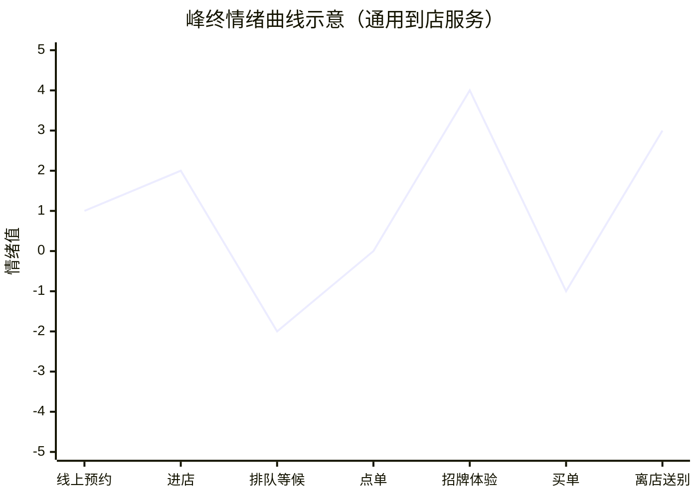

# 用户体验地图与服务蓝图 — 用户视角画完整旅程，供给视角排资源账，峰终定律决定有限的资源砸向哪里

## 框架

**用户体验地图**：以一位画像具体的用户的第一次完整使用为轴，把旅程摊开成一张图。五个要件：

1. **画像具体的主角**：一位真实可感的种子用户，不是抽象平均人。
2. **目标与预期**：TA 来是为了什么结果？买电钻的人要的是墙上那个孔，不是电钻本身。预期决定情绪基线。
3. **触点序列**：从初次接触到达成目标（或中途放弃），每一次与产品或服务的接触。
4. **使用路径**：触点连成的实际行进路线——用户真实怎么走，而非你设想怎么走。
5. **情绪曲线**：横轴排触点顺序，纵轴标情绪高低，连成一条起伏线，爽点与崩溃点一目了然。

机会点＝情绪低谷中可被翻转的触点：小投入就能把不满变成惊喜的位置。

**服务蓝图**：把地图翻到供给面。每个触点背后列三行——
前台（用户可见的界面与角色）、后台（支撑该触点的内部能力）、支撑系统（系统、供应链、规则）。
一张表看全「每一分体验背后压着多少成本」，体验与成本的取舍被摆上台面。

两张图的分工：

| | 体验地图 | 服务蓝图 |
|---|---|---|
| 视角 | 用户 | 服务提供者 |
| 轴线 | 情绪起伏 | 流程与成本 |
| 回答 | 用户在哪爽、在哪崩 | 资源从哪来、押在哪 |

蓝图落地三件事：

- **给一眼**：第一屏就回应「你是来干什么的」，让用户的目标被看见、被接住。
- **修一条路**：保证一条走得通的主路径；用户卡住走不动的地方，就是服务的崩溃点。
- **守三个点**：峰值、终值、忍耐底线。

**峰终定律**：源自心理学家卡尼曼对体验记忆的研究。人回忆一段经历时不做全程平均，
只取两个采样点：情绪最强的峰值（正或负）与收尾时刻的终值；中间各段的好坏与时长，对记忆影响很小。

推论：资源有限时不要摊平。集中火力制造一个正峰值，守住终值，允许中段平庸；
唯一红线是全程不击穿用户的忍耐底线——等待时长、步骤数、失败次数，都存在可量化的放弃阈值。

## 怎么用

1. **选定主角**：写下画像、目标与预期。判断题：TA 要的结果是什么，而不是 TA 要哪个功能？
2. **走一遍首程**：亲自以新用户身份完整走一次，逐个记下触点。
3. **标情绪**：给每个触点打分（-5 到 +5），连成曲线。
4. **找两类点**：崩溃点（走不下去之处）立即修；情绪低谷评估能否翻转为机会点。
5. **翻面画蓝图**：为每个触点补前台角色、后台能力、支撑系统，并标注成本。
6. **重排资源**：砍掉平庸环节的冗余投入，把省下的资源砸向一个主峰值与一个终值动作。判断题：用户离开那一刻，最后带走的画面是什么？
7. **定忍耐底线**：给关键触点写下量化阈值并持续监控，任何降本动作不得击穿它。
8. **定期重画**：改版、调价、换动线都会改写旅程；两张图要跟着当前版本走，不是立项那张。

## Checklist

- [ ] 地图以一位具体用户的首次完整旅程为轴，而非功能清单
- [ ] 每个触点都有情绪打分
- [ ] 主路径无断点，已知崩溃点有修复或兜底
- [ ] 蓝图上每个触点都对得上前台角色与后台能力
- [ ] 明确了唯一的主峰值与一个终值动作
- [ ] 忍耐底线有量化阈值且有监控
- [ ] 有意识地选择了允许平庸的环节
- [ ] 平庸环节的达标线有定义，且高于忍耐底线
- [ ] 最近一次大改版后，两张图重画过

## 反模式

- **错误**：用管理员视角画产品全景图。
  **为何错**：罗列自己有什么，看不见用户卡在哪、按什么顺序遭遇什么。
  **正确**：沿一位具体用户的实际路径，把图重画一遍。

- **错误**：每个触点都追求超预期。
  **为何错**：处处拔高等于处处平庸，成本冗余，真正的峰值反而立不起来。
  **正确**：多数触点达标即可，把资源集中做尖一处。

- **错误**：只盯转化数据，不看用户故事。
  **为何错**：数据是结果的截面，解释不了用户为何在某处折返或放弃。
  **正确**：用一个吃透了的代表性用户故事，校准对数据的解读。

- **错误**：虎头蛇尾，收尾潦草。
  **为何错**：终值在记忆里权重极高，糟糕的结尾会覆盖前面攒下的好感。
  **正确**：设计一个低成本、高确定性的收尾动作。

- **错误**：只画体验地图，不画服务蓝图。
  **为何错**：只许愿不算账，承诺了资源撑不起的体验，触点会在高峰期塌方。
  **正确**：每个体验承诺对应一行资源账，账撑不住就砍承诺。

## 图

排队与买单是允许存在的低谷（不破忍耐底线即可）；「招牌体验」是刻意做尖的峰值；离店送别是低成本守住的终值。

## 案例速写

- 某北欧家居卖场动线长、店员少，但样板间的沉浸感制造了正峰值，出口一元甜筒守住终值——多数顾客带着好记忆离场。
- 某中端连锁酒店把住客首程拆成十余个节点逐一配资源：进门奉茶做峰值，退房递水做终值，大堂装修反而克制——资源按峰终排布，不做平均主义。
