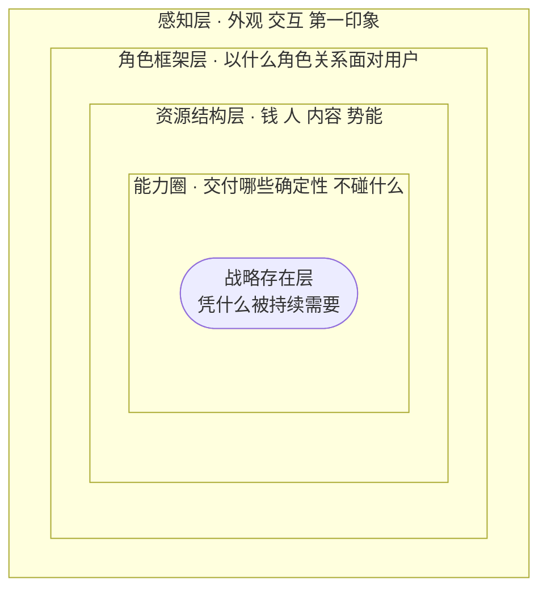

# 用户体验五层次 — 把「好不好用」拆成五层结构；评估产品与人都从最核心的战略存在层往外看，停在表面观感是最浅的判断

## 框架

体验不是一个笼统的形容词，而是五层结构的叠加。由内而外：

**1. 战略存在层（内核）**
一切从两个问题起步：做这件产品，我们自己要换回什么；用户又能从里面拿到什么、凭什么长期离不开我们。
存在的根基不是「我很强」，而是「有人持续需要我」。答不出这两问，后面四层都是空转。

**2. 能力圈**
为兑现内核的那份承诺，哪些事必须亲手做到确定？哪些事明确划出去、绝不去碰？
有战略牵引，能力圈会朝固定方向生长；没有牵引，它的伸缩只是随机漂移。

**3. 资源结构层**
钱、人、内容、势能与盟友。手里能调动什么，决定能力圈撑得多大；
而资源愿不愿向你汇聚，反过来取决于你的战略是否被认同——别人是冲着那个方向来帮你的。

**4. 角色框架层**
在产品里，指信息与功能如何组织、页面如何勾连；在服务里，指以什么角色关系面对用户。
用户能感知到的一切，都被这一层预先框定：同一个人换一身制服，应答方式就变了。

**5. 感知层（外壳）**
视觉、听觉、触感、文案气质——第一印象的发生地。它重要，但只是最外面那层壳：
界面再精致，若解决不了用户的事，也赢不过一个简陋却把事办成的对手。

核心判断：第一印象由感知层决定，长期依赖由战略存在层决定。
浅交往看外两层足够；要建立深度绑定的关系（合伙、重仓、长期共事同理），必须看穿内三层。

**评估一个人的内三层，三个问题：**
- TA 想以什么方式被这个世界需要？
- 为此，TA 长期在攒什么本事？
- TA 今天的位置与资源，是沿什么路径换来的？

## 怎么用

1. **从内核问起**：这个产品（或这个人）想成为谁的、什么样的依赖？判断题：把它从世界上拿掉，谁会真的难受？
2. **核对能力圈**：为兑现那份依赖，哪些确定性必须自己交付？「不做清单」写出来了吗？
3. **盘点资源结构**：现有的钱、人、内容、势能，撑得起这个能力圈吗？缺口打算拿什么去换？
4. **审视角色框架**：现在的信息组织与服务角色，是否把内三层的实力顺畅递到用户手上？
5. **最后打磨感知层**：第一印象配得上内核吗？别让包装先透支了信任。
6. **给抱怨归层**：听到「不好用」先定位层级——配色不喜欢是感知问题，流程绕是框架问题，供给跟不上是资源问题，而「他要的你压根不打算给」是战略问题。
7. **定期复核内核**：市场在变，两问的答案还成立吗？战略存在层不是立项时写一次就完事的。

## Checklist

- [ ] 能用一句话说清：用户凭什么持续依赖这个产品
- [ ] 写下了明确「不做」的事项清单
- [ ] 资源盘点覆盖钱、人、内容、势能四类
- [ ] 每条用户抱怨都归到了具体层级，而非笼统记作「体验差」
- [ ] 感知层的投入没有挤占内三层的建设
- [ ] 关键改动能说清：动的是哪一层、会波及哪几层
- [ ] 评估长期合作对象时，看过对方的内三层

## 反模式

- **错误**：凭第一印象下结论。
  **为何错**：感知层最容易修饰、也最容易被抄走，据此判断等于只看包装。
  **正确**：把第一印象当入口，逐层向内核实到战略存在层。

- **错误**：战略缺位地堆功能。
  **为何错**：没有内核牵引，能力圈的扩张是随机的，资源被摊薄在不相干的方向上。
  **正确**：先钉死内核两问，再决定扩什么、砍什么。

- **错误**：用改版界面拯救留存。
  **为何错**：留存下滑多半病在资源或战略层，翻新外壳是给内伤贴创可贴。
  **正确**：先归层诊断，确认病灶在哪一层，再对症投入。

- **错误**：拿单点数据评人评产品。
  **为何错**：截面数据只描述现状，讲不出内三层是如何长成今天这样的。
  **正确**：追问对方的战略、能力圈与资源是沿什么路径累积的。

## 图

## 案例速写

- 搜索引擎早期竞争：几家产品的输入框在感知层几乎无差别，胜负实际发生在内容储备（资源结构层）与本地化运营（能力圈）。
- 门户时代的某搜索页首屏被大幅广告占据、单屏只露少量结果，对手用素净首屏一次给出几十条——资源相近时，输赢落在角色框架层。
