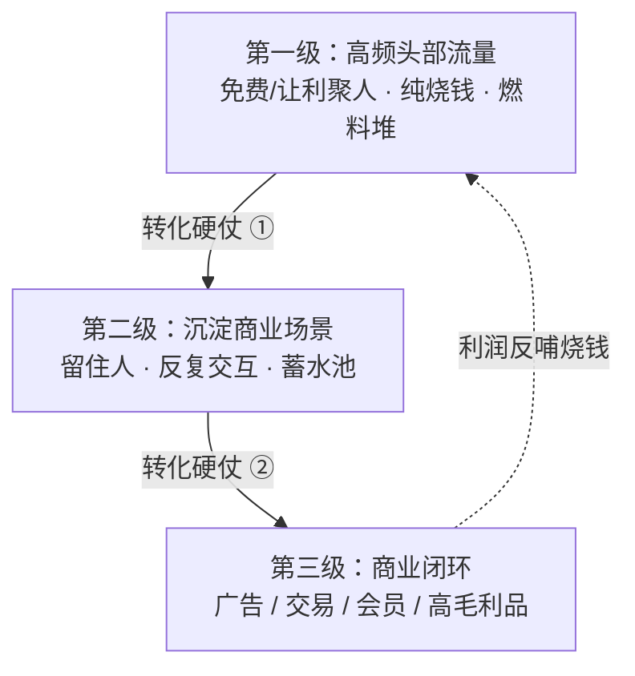

# 三级火箭 — 高举高打的商业模式设计：高频头部流量点火，导入可沉淀的商业场景，末级完成闭环变现——势能不够者勿玩

## 框架

三级结构，每级只干一件事：

- **第一级：高频头部流量**。用免费或让利的高频应用聚集海量用户。这一级不赚钱，本质是燃料堆——靠割让利益换势能。
- **第二级：沉淀商业场景**。把第一级的人流导入一个能留住人、反复交互的场景：平台、门店、内容社区、账号体系。流量不沉淀就是过路水。
- **第三级：商业闭环**。在沉淀下来的场景上完成变现——广告、交易、会员、高毛利产品，用利润反哺前两级的持续烧钱。

为什么恰好三级：级数太少，单级负担过重，推力不足以突破；级数太多，链条过长，失控概率倍增。三级是势能与可控性权衡后的选择——商业模型同理，变现链路越长越容易玩脱。

成立的三个前提：

1. **一级必须真高频**。递推方向只能从高频指向低频，反过来推不动。
2. **发射需要巨大势能**。一级要长期烧钱养用户，操盘者须有相称的融资能力、短期聚拢资源的号召力，还要扛得住被抢走流量的同行的集体敌意——这从来是蓄谋已久的强攻，不是顺手为之。
3. **每级转化都是硬仗**。流量导入场景、场景导入变现，任何一级接不上，全箭报废。

对局含义：火箭玩家不在你以为的战场赚钱——他把你赖以获利的品类当燃料免费烧。用单品利润逻辑迎战这种对手，注定错位挨打。

## 怎么用

1. **验频次**：第一级候选，用户一周碰几次？拿数据说话。判断问题：它确实比我要推的第二级更高频吗？
2. **设场景**：用户从一级过来后停在哪、为何留下、多久回访？判断问题：我是在建蓄水池，还是只挖了条过水沟？
3. **算闭环**：第三级的毛利与规模，能否覆盖一级的烧钱周期？判断问题：闭环接上之前，账上的钱烧得到那一天吗？
4. **称势能**：融资能力、资源号召力、抗敌意的组织韧性。判断问题：三样里缺哪样？缺任何一样就不该点火。
5. **看对手**：竞对是否在玩火箭？判断问题：我赚利润的品类，是不是正被别人当燃料免费倾销？若是，避开正面，转去它的火箭够不着的市场。

## Checklist

- [ ] 一级频次有真实数据支撑，不是「我感觉高频」
- [ ] 全链路频次递减：一级 > 二级 > 三级
- [ ] 沉淀场景已建好或有明确方案，不是「先攒人再说」
- [ ] 末级毛利测算过，闭环能自养全链路
- [ ] 融资与资源势能盘点过，烧钱周期扛得住
- [ ] 想清楚了敌意从哪来、怎么扛
- [ ] 前提不满足时，已老实退回单级赚钱的朴素模式

## 反模式

### 低频硬点火
- 错误做法：拿一个低频应用当第一级，指望它带动新业务。
- 为什么错：低频聚不起势能，也推不动更低频的东西；方向反了更是全盘不成立。
- 正确做法：要么先做出真高频入口，要么放弃火箭，直接在本业赚钱。

### 有流量没场景
- 错误做法：用户量涨得漂亮就急着变现，中间没有承接场景。
- 为什么错：流量不沉淀就留不住人，变现一伸手用户就散——一级直怼三级，中段断裂。
- 正确做法：先搭能留人的第二级，验证「来了会留、留了会回」，再放大一级。

### 无势能强启
- 错误做法：小团队小资金，照抄巨头的免费打法开局。
- 为什么错：一级是纯烧钱期，没有融资与资源势能撑腰，中途断粮箭毁人亡。
- 正确做法：按体量选模式；势能不足就做单级生意，先赚钱活下来。

### 用单品逻辑迎战火箭
- 错误做法：对手免费倾销你的利润品类，你降价硬扛。
- 为什么错：他烧的是燃料，你割的是命根，成本结构不同，耗不过。
- 正确做法：不在他的燃料区拼价格，转向他的链路覆盖不到的品类或市场。

## 图

## 案例速写

- 一家安全公司用免费杀毒击穿收费市场、聚起最大用户盘，导入浏览器与导航页，再靠广告完成闭环——三级点火全中。
- 一家以输入法起家的搜索公司，后来借股东的高频社交流量做一级，在聊天场景内嵌搜索做二级，变现做三级——一级火箭甚至可以借来。
- 某手机厂商把硬件当头部流量而非利润中心，自建零售网沉淀用户，利润寄望于生态内高毛利业务——同行按单机利润应战即错位。
- 反例：共享单车高频且量大，但迟迟没建起能沉淀用户的第二级场景，头部流量白白流走。
