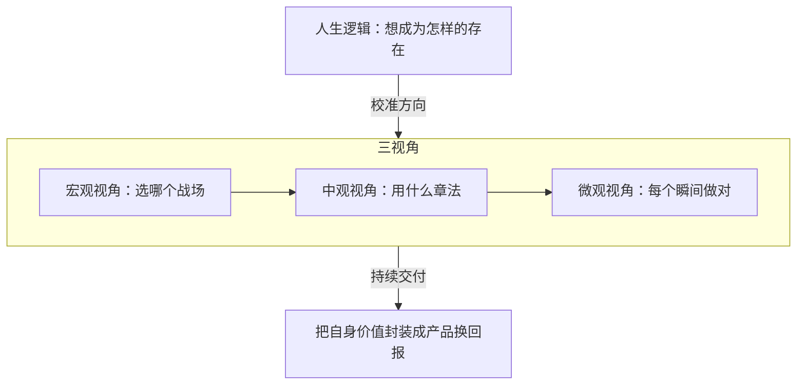

# 产品世界观 — 一句话定位

产品能力是一套普适的底层操作系统：用微观、中观、宏观三层视角看清一件事，再用人生逻辑校准方向——既拿来做产品，也拿来做人生选择。

## 框架

### 1. 产品能力是底层能力

- 完整动作链：从噪声里筛出有效信息 → 认出真正的关键点 → 把有限资源组织成系统 → 把自身价值封装成可交付的成果并换回报酬。
- 这条链与经营人生同构：选方向是机会判断，学本事是建系统，求职、合作、表达都是把自己「产品化」之后的交付。练产品即练人生。
- 副产品是内心秩序：有了认知框架，信息不再只是情绪冲击；被否定、推倒重来降级为迭代的常规成本，而不是对自我的审判。抗挫折能力由此长出。

### 2. 三视角：微观、中观、宏观

- **微观视角**：对用户情绪与体验的颗粒度感知——一次卡顿、一句文案、一个让人起戒备的弹窗。这种判断力长在身上，靠海量一手反馈喂出来，类似熟手能尝出汤里盐差半克。
- **中观视角**：可传授的方法论与工作套路——画像、旅程图、流程拆解、数据复盘。它是前人验证过的棋谱，让工作有章法、可排查、能与团队对齐。
- **宏观视角**：选战场的能力——点线面体的依附关系、价值网中的位置、大盘趋势的方向。单点体验再好，也赢不了一场选错了「面」的战争。
- 三层关系：大公司是学中观视角的好学校，但久待会被角色驯化、钝掉微观体感；发烧友有体感缺章法；缺宏观者赢了体验输掉终局。高手三层齐备，缺哪层补哪层。

### 3. 人生逻辑大于商业逻辑

- 商业逻辑的目标函数是效率与收益：哪里回报高就去哪里。人生逻辑的目标函数是存在感：我想以什么方式存在？做什么事让我笃定？
- 两者冲突时以人生逻辑为准：长赛道靠可持续的内在驱动，一件「账面该做」却与自我认同错位的事，撑不过漫长的无反馈期；与存在感对齐的事才熬得住。
- 合作同理：只靠利益维系的关系极脆弱，穿越长周期需要更深的确定感与相互依赖。选赛道、挑伙伴，先问人生逻辑，再算商业逻辑。

## 图

## 怎么用

### 三视角自诊与补课

1. 列出你最近三个产品决策，逐条标注依据来源：体感、方法论，还是趋势判断。
2. 对照补课：说起来头头是道、落地总差口气 → 缺微观视角，去一线泡真实用户反馈；感觉敏锐却讲不清、不可复制 → 缺中观视角，强制把判断写成可检验的框架；单点很强却在萎缩的市场里内卷 → 缺宏观视角，先换战场再优化打法。
3. 判断：评估一个人是不是高手，不看头衔，看三层哪层是短板、他是否自知。

### 用人生逻辑选赛道

1. 给每个候选选择打两组分：商业逻辑分（市场规模、增速、回报），人生逻辑分（愿不愿意做十年、失败了是否仍觉得值）。
2. 追问：这件事五年不给正反馈，我还做吗？我被收益吸引，还是被事情本身吸引？
3. 判断：双高才进入；只有商业分高，要么放弃，要么承认自己在做短线并按短线管理。

## Checklist

- [ ] 我能说清最近一次关键决策用的是哪一层视角
- [ ] 本周接触过一手用户反馈，而非只看报表转述
- [ ] 核心判断已沉淀为可传授、可检验的中观框架
- [ ] 做过宏观追问：我所在的「面」在涨还是在缩
- [ ] 主业通过了「五年无正反馈仍愿做」的测试
- [ ] 重大合作评估过纽带：仅利益，还是有更深的确定感

## 反模式

| 错误做法 | 为什么错 | 正确做法 |
|---|---|---|
| 唯套路论：言必称框架，把方法论当全部 | 中观视角只保下限，缺颗粒度感知，产出「都对但不对味」 | 每个框架结论都用一手体感验一遍 |
| 唯体感论：全凭感觉，拒绝方法论 | 不可解释、不可复制、无法协作，规模一大就失控 | 把体感沉淀成可传授的套路 |
| 体验万能：以为单点极致就能赢终局 | 终局由资本、生态位等宏观变量决定 | 先用宏观视角选对战场，再谈体验 |
| 纯商业逻辑择业：哪里钱多冲哪里 | 内在驱动缺位，撑不过无反馈的长周期 | 先过人生逻辑筛选，再用商业逻辑排序 |

## 案例速写

- 功能机巨头的坠落：单机工艺无可挑剔，输给智能生态的宏观转向——微观优势救不了宏观误判。
- 共享出行混战：多家体验相近的产品对撞，终局由资金、网络效应等宏观变量写就。
- 假想案例：两位工程师同入热门赛道，一位为估值而来，一位为做出让自己骄傲的工具而来；行业遇冷时前者离场，后者熬成标准制定者。
